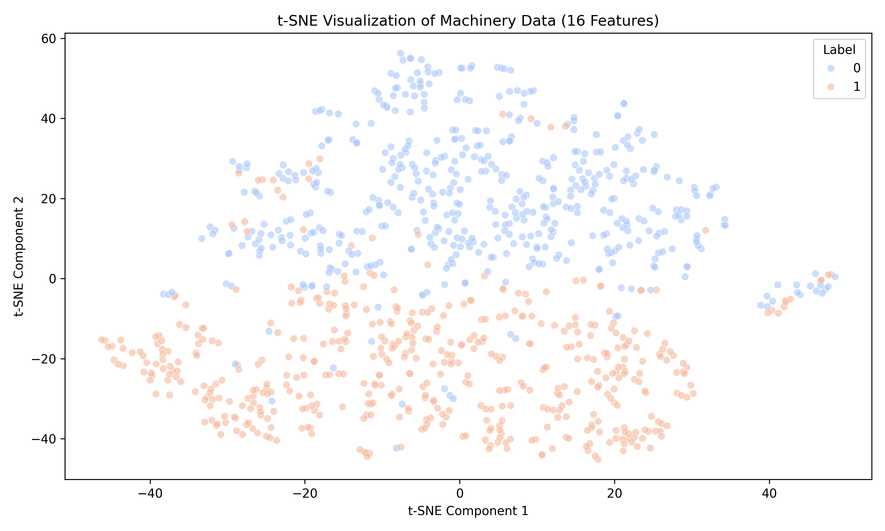
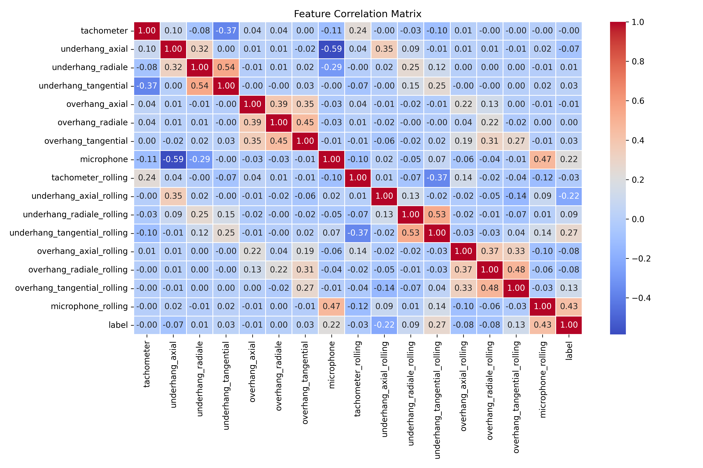
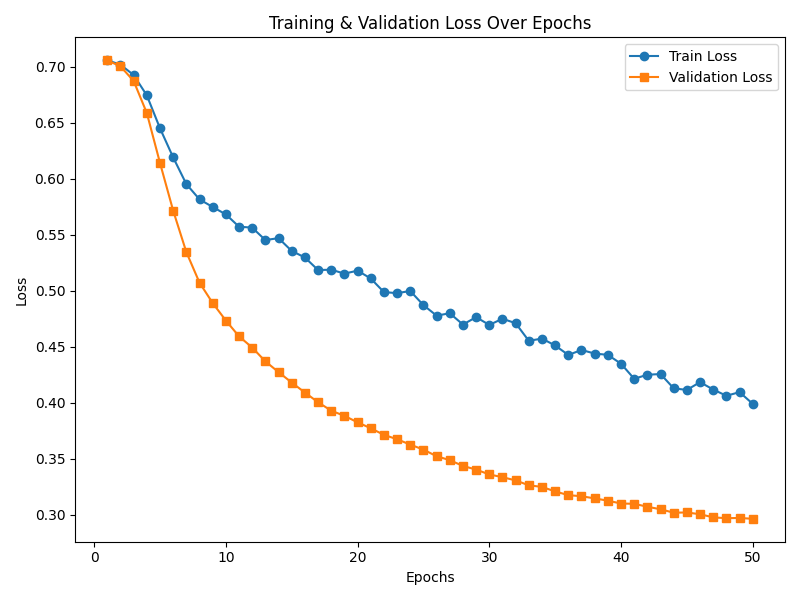
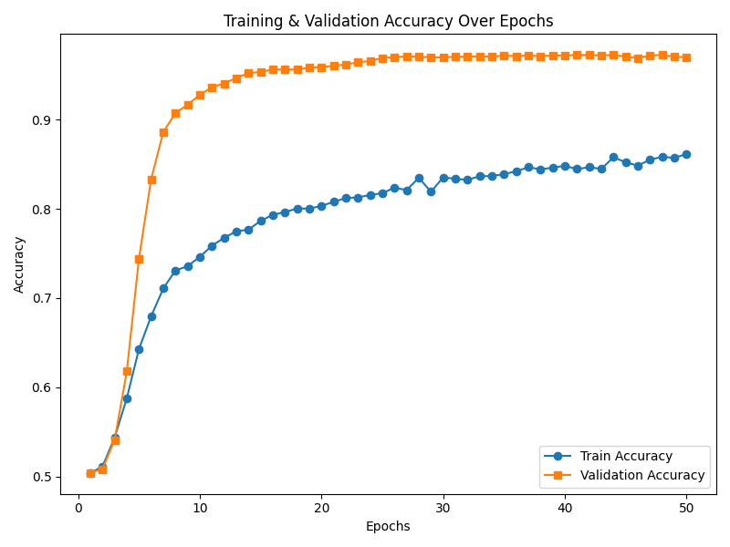
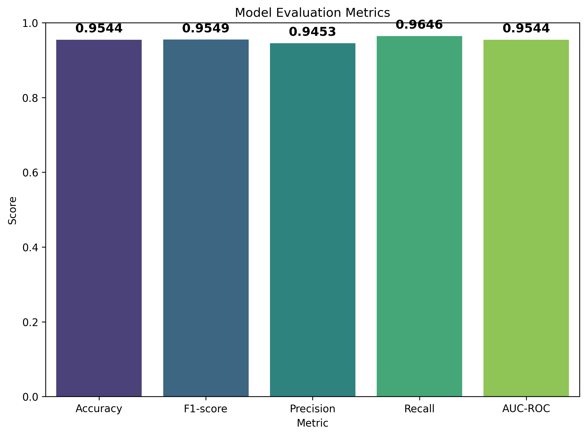

# Classificação de Falhas em Máquinas com MAFAULDA

Este repositório apresenta um fluxo de trabalho para detecção e classificação de falhas mecânicas usando dados de séries temporais multivariadas do [conjunto de dados MAFAULDA](https://www.kaggle.com/datasets/uysalserkan/fault-induction-motor-dataset/data).

Passos do projeto:
1. **Análise Exploratória de Dados (EDA):** Pacote `ydata-profiling`
2. **Engenharia de Features:** downsampling, média por janela deslizante
3. **Modelo de Rede Neural:** MLP personalizado em PyTorch
4. **Avaliação:** Acurácia, F1-score, AUC, Precisão, Recall, AUC-ROC

---

## Visão Geral

A detecção de falhas mecânicas frequentemente se baseia na análise de sinais de vibração, gravações de microfone e outros sensores. Nosso objetivo é classificar séries temporais em condições *normais* ou *com falha* (ex.: desbalanceamento), utilizando:

1. **Análise Exploratória de Dados (EDA):** Perfilagem rápida (`ydata-profiling`), visualização de séries temporais, verificação inicial de correlações.  
2. **Engenharia de Features:** Downsampling para reduzir ruído, médias móveis para suavização, uso opcional de t-SNE para visualização.  
3. **Modelo de Deep Learning:** **Multi-Layer Perceptron (MLP)** em PyTorch, treinado com as features engenheiradas para distinguir as classes.  
4. **Avaliação do Modelo:** Uso de métricas (Acurácia, F1-score, Precisão, Recall, AUC-ROC) para medir o desempenho.

---

## Estrutura do Repositório

```
├── figures/                        # Resultados gerados pelo src/main.py
├── notebooks/
│   ├── EDA.ipynb                 # Análise Exploratória de Dados
│   ├── FeatureEngineering.ipynb  # Downsampling, médias móveis, visualização t-SNE
│   └── MLP_Training.ipynb        # Treinamento do MLP em PyTorch
├── data/
│   └── ...                       # Dados brutos/processados (ignorado no versionamento)
├── src/                           # Arquivo Python principal
│   ├── main.py
├── environment.yml               # Especificação do ambiente Conda
├── README.md                     # Este arquivo
└── ...
```

---

## Requisitos e Configuração

1. **Clonar o Repositório**  
   ```bash
   git clone git@github.com:yurimarca/machinery-fault-classification.git
   cd machinery-fault-classification
   ```

2. **Ambiente Conda**  
   - Certifique-se de que tem [conda](https://docs.conda.io/en/latest/) instalado.
   ```bash
   conda env create --file environment.yml
   conda activate ml
   ```

3. **Posicionamento dos Dados**  
   - Baixe o conjunto de dados MAFAULDA do [Kaggle](https://www.kaggle.com/datasets/uysalserkan/fault-induction-motor-dataset/data) ou outras fontes.  
   - Coloque todos os arquivos CSV na pasta `data/`. (Esta pasta está `.gitignore`d para evitar upload de arquivos grandes.)

4. **Jupyter Notebooks**  
   - Inicie o Jupyter Lab ou Notebook:
   ```bash
   jupyter lab
   ```
   - Abra e execute os notebooks em `notebooks/`.

---

## Passos Desenvolvidos

### 1. Análise Exploratória de Dados (EDA)
- **Arquivo**: `notebooks/EDA.ipynb`
- Carrega os dados e verifica estatísticas básicas com `ydata-profiling`. 
- Para os dados normais foi gerado um relatório em html disponível em `notebooks/normal_data_report.html`.
	- Podemos notar que as features são normalmente distribuídas.
	- Poderíamos descartar uma das features `underhang_radiale` e `microphone` pois possuem alta correlação como é destacado em alertas.
- Plota sinais de séries temporais (normal vs. desbalanceado) para observação de diferenças.

### 2. Engenharia de Features
- **Arquivo**: `notebooks/FeatureEngineering.ipynb`
- Aplica downsampling para reduzir ruído de alta frequência.
- Usa média por janela deslizante para suavização e incorporação de dados históricos.
- Visualiza t-SNE nos dados transformados para confirmar separabilidade dos rótulos.
	- Notamos uma clara separação entre os dois rótulos através do método de diminuição de dimensionalidade t-SNE.
	- Isso indica que podemos encontrar uma regra (ou treinar um modelo) que separe os dados com sucesso. 

### 3. Treinamento do Modelo (MLP)
- **Arquivo**: `notebooks/MLP_Training.ipynb`
- Como a separação não-linear dos dados parece claramente distinguiras classes, decidi utilizar uma rede neural padrão Multi-Layer Perceptron (MLP).
- Mesmo que esse modelo não tenha caracteristicas para considerar componentes de time-series, a feature engineering incorpora noção temporal ao computar a uma média das features em formato de rolling time window.
- MLP parametrizável no PyTorch para classificação.
- Treina o modelo com as features computadas.
- Monitora métricas como acurácia e outros indicadores de desempenho.
- Após o treinamento de um modelo de MLP simples e sem muitos testes, parti para a produção do `main.py`.


### 4. Pipeline PyTorch Principal (`main.py`)
- Orquestra todo o processo de ingestão de dados, engenharia de features, treinamento e avaliação.

**Exemplo de Execução:**
```bash
python src/main.py
```
Saída esperada:
- **Plots de Perda & Acurácia** em `../figures/`
- **Visualização t-SNE** em `../figures/tsne_visualization.png`
- **Matriz de Correlação** em `../figures/correlation_matrix.png`
- **Métricas Finais** impressas no console e salvas em `../figures/evaluation_plot.png`


#### **Fluxo de Execução:**
1. **Carregamento dos Dados**  
   - Filtragem dos dados normais e desbalanceados.  
   - Mesclagem dos dados com adição de rótulos binários (`0` = normal, `1` = desbalanceado).

2. **Engenharia de Features**  
   - Aplica downsampling e cálculo de média por janela deslizante.  
   - Normaliza os dados usando `StandardScaler`.
   - Visualiza os resultados do t-SNE para verificar separabilidade das classes. Resultados sugerem clara separação dos dados, dando bons indícios para o treinamento de um modelo MLP. 
   
   - Gera matriz de correlação entre as features e o label. Podemos notar que `microphone_rolling` possui correlação com label, indicando uma excelente feature para classificação.
   

3. **Divisão dos Dados**  
   - Usa um método baseado em séries temporais (`time_series_split`) para criar os conjuntos de **treino**, **validação** e **teste**. 
   - Esta função é importante pois considera e preserva a caracteristica de time series dos dados.
   - Garante que cada conjunto mantenha uma proporção balanceada dos dados.

4. **Treinamento**  
   - Constrói um `TimeSeriesMLP` com hiperparâmetros configuráveis `(hidden_dim, n_layers, dropout_prob)`.  
   - Treina por até 50 épocas, registrando a perda e acurácia de validação a cada época.  
   
   

5. **Avaliação**  
	- Os resultados finais demonstram que o modelo conseguiu distinguir com eficácia entre condições normais e de falha:
   
   - Isso indica que a combinação de downsampling + média móvel com um MLP é eficaz para detectar falhas no conjunto de dados MAFAULDA.

## Próximos Passos

1. **Otimização de Hiperparâmetros**: Grid Search, Evolutionary optimization ou Bayesian optimization para ajustar quantidade de `hidden layers`, taxa de aprendizado e dropout..
2. **Redes Neurais mais Complexas**: Testar CNN, LSTM e outras redes que podem considerar informação temporal nativamente sem a necessidade de produção de features.
3. **Consideração de Mais Classes**: Expandir para todas as falhas do dataset MAFAULDA.


## Considerações finais

Este repositório fornece uma solução eficiente para a classificação de falhas em máquinas, utilizando como modelo a rede neural mais simplista possível com arquitetura da rede parametrizável. Após a aplicação de pre-processamento, ou então geração de novas features para incorporar relações temporais na entrada da rede neural, conseguimos atingir excelentes resultados.

### Yuri Marca, 2025
